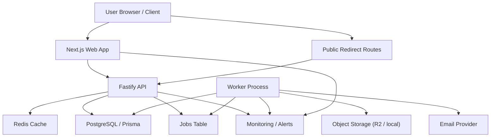
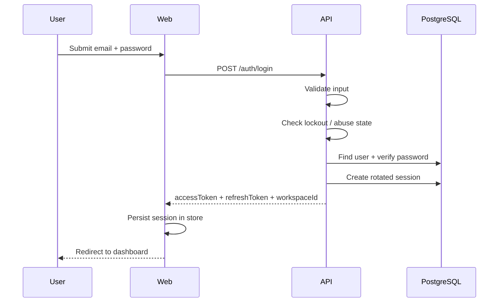
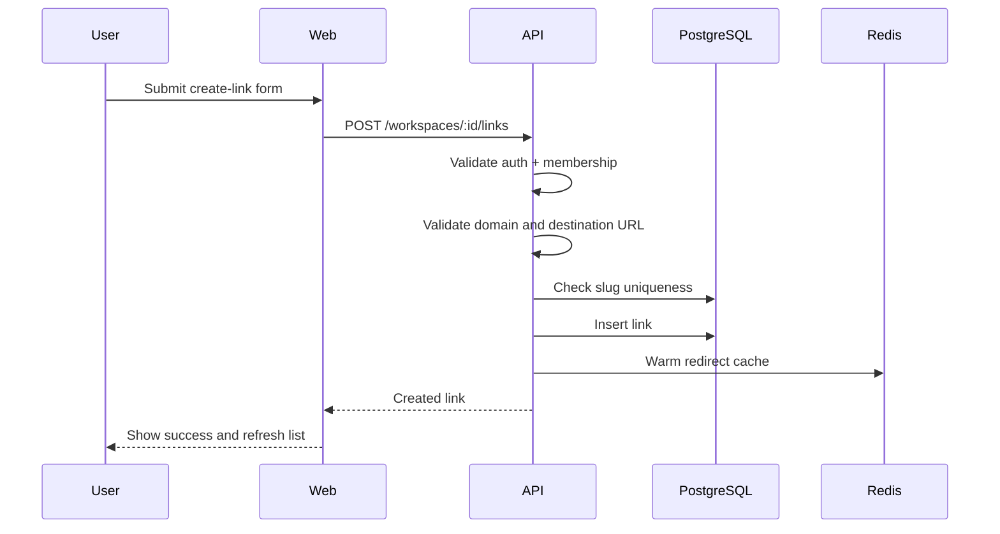
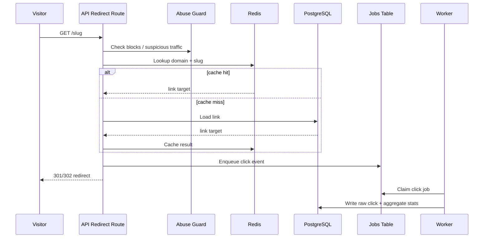
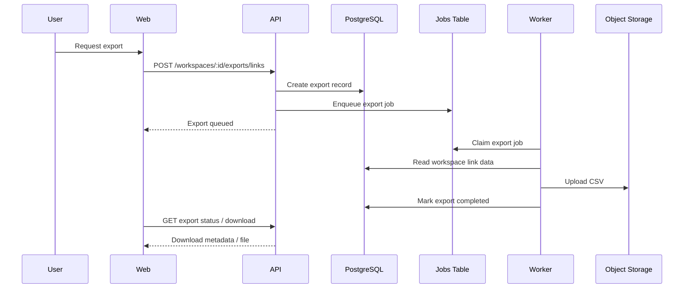
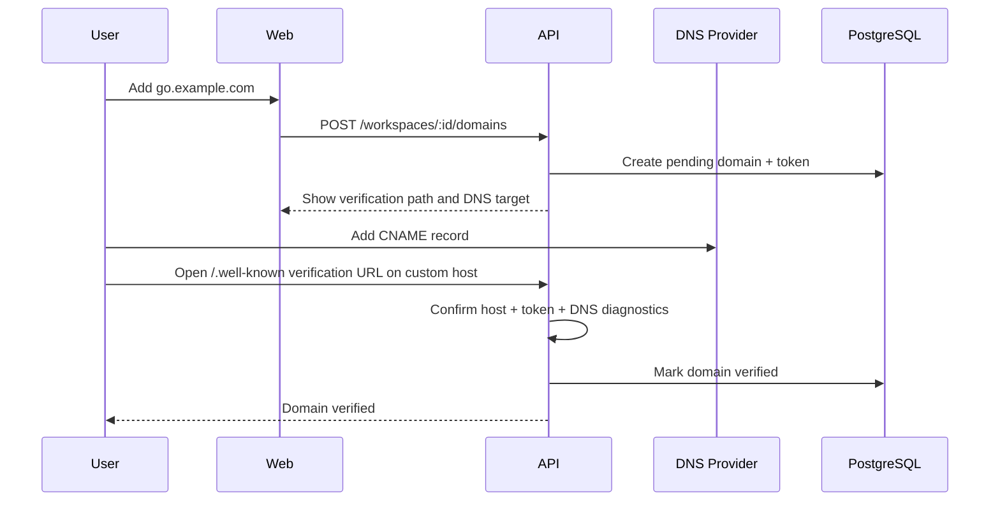

# Architecture

This document explains how UrlShortener is structured as a running system.

Use it when you want to understand:

- which service handles which responsibility
- how key flows move through the stack
- where caching, jobs, analytics, and custom domains fit

## High-Level Topology

## Service Responsibilities

### `web`

Responsibilities:

- authentication UI
- dashboard experience
- link creation and management flows
- analytics presentation
- settings, members, domains, API keys, exports

Main technology:

- Next.js App Router
- React Query
- Zustand

### `api`

Responsibilities:

- user and session auth
- workspace authorization
- link CRUD
- redirects
- analytics queries
- invitations
- custom domain lifecycle
- API-key auth and usage logging
- audit and ops endpoints

Main technology:

- Fastify
- Prisma
- PostgreSQL
- Redis-backed cache helpers

### `worker`

Responsibilities:

- process queued emails
- process click events
- generate exports
- recover stale jobs
- expose worker health endpoints

Main technology:

- Node.js process
- Prisma-backed durable jobs

## Core Storage Layers

### PostgreSQL

Used for:

- transactional product data
- job queue state
- analytics support tables
- audit and abuse signals

### Redis

Used for:

- redirect lookups
- faster short-link resolution
- resilience during heavy redirect traffic

### Object Storage

Used for:

- generated export files

Recommended production provider:

- Cloudflare R2

## Request Flows

## 1. Login Flow

## 2. Link Creation Flow

## 3. Redirect Flow

## 4. Export Flow

## 5. Custom Domain Verification Flow

## Security Layers In The Architecture

- route-level rate limiting at the API layer
- in-memory auth and API-key lockout guard
- abuse-signal persistence in PostgreSQL
- redirect cache isolation from analytics writes
- async jobs to keep slow work off request paths
- hashed tokens and keys
- scoped API-key auth

## Operational Characteristics

### Good startup-stage properties

- monorepo is simple to reason about
- worker separates slow work from request handling
- Redis keeps redirect performance reasonable
- analytics can grow without redesigning the whole app

### Current limits

- auth lockout memory is process-local
- Redis/cache behavior still depends on correct deployment topology
- custom-domain operations still rely on external DNS/TLS setup
- runtime tests require real local services

## Where To Read Next

- [Product_structure.md](D:\Projects_Components\url-shortener\docs\Product_structure.md)
- [api.md](D:\Projects_Components\url-shortener\docs\api.md)
- [database.md](D:\Projects_Components\url-shortener\docs\database.md)
- [deployment.md](D:\Projects_Components\url-shortener\docs\deployment.md)
